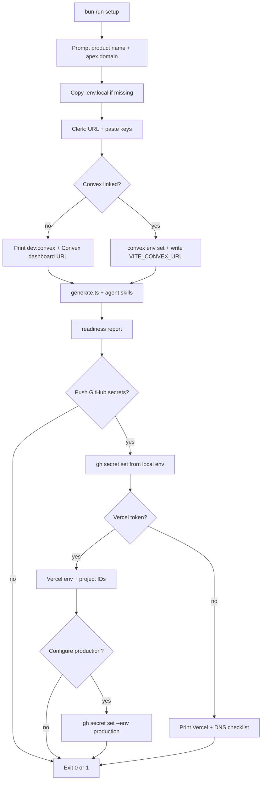

# Setup automation

What `bun run setup` automates, what stays manual, and dashboard URLs for fallbacks.

**Related:** [getting-started.md](./getting-started.md), [environments.md](./environments.md), [ci-cd.md](./ci-cd.md)

## Wizard behavior

- **Interactive** (local TTY): prompts run each time; previous answers from [`.reactor/setup.json`](../.reactor/setup.json) are defaults (Enter keeps them).
- **Non-TTY** (CI, piped stdin): skip prompts; use existing `.reactor/setup.json` and env only.
- Dashboard URLs are printed as clickable links; setup asks **Open link? [y/N]** before opening the browser (skipped in non-TTY runs).

Step-by-step summary: [getting-started.md](./getting-started.md#2-setup-wizard-bun-scriptssetupts).

## Config persistence

### `.reactor/setup.json` (committed, no secrets)

```json
{
  "productName": "My App",
  "apexDomain": "example.com",
  "github": { "org": "acme", "repo": "my-app" },
  "removeMitLicense": true
}
```

Also writes `packages/config/product.ts` (`PRODUCT_NAME`), rebrands `README.md` when forking from the template, and when `removeMitLicense` is true replaces MIT [`LICENSE`](../LICENSE) from [`.reactor/LICENSE.proprietary.template`](../.reactor/LICENSE.proprietary.template) (skipped on the upstream `PeterHewat/Reactor` remote).

### Secrets (never in `.reactor/`)

| Location               | Contents                                          |
| ---------------------- | ------------------------------------------------- |
| `apps/web/.env.local`  | `VITE_*`, `CLERK_SECRET_KEY`, E2E vars            |
| Root `.env.local`      | `CONVEX_DEPLOYMENT`, optional `CONVEX_DEPLOY_KEY` |
| GitHub Actions secrets | CI and deploy keys                                |
| Vercel project env     | Build-time `VITE_*` per environment               |

---

## Automated vs manual

### Still manual or checklist-only

| Area                     | Today                                                                                                     |
| ------------------------ | --------------------------------------------------------------------------------------------------------- |
| Account signup / billing | Convex, Clerk, Vercel, GitHub dashboards                                                                  |
| Convex first link        | User runs `bun run dev:convex` (OAuth); wizard continues when linked                                      |
| Clerk app creation       | Dashboard (Platform API optional future)                                                                  |
| Clerk allowed origins    | Printed checklist; user adds in dashboard                                                                 |
| DNS at registrar         | Hints from Vercel step; user creates records                                                              |
| E2E test user            | Wizard defaults `e2e.test@{apex}`; creates user via Clerk API when `sk_test_` is set; syncs email to `gh` |
| Org GitHub policies      | Branch protection, required reviewers — outside setup                                                     |

### Feasibility summary

| Category    | Examples                                                                                          |
| ----------- | ------------------------------------------------------------------------------------------------- |
| **Script**  | `PRODUCT_NAME`, `.env.local`, `convex env set`, deploy keys, `gh secret set`, Vercel env via API  |
| **Guided**  | Clerk app + paste keys, `dev:convex` link, Vercel import, DNS, E2E user                           |
| **Manual**  | Account signup, registrar DNS, Clerk auth methods, `prod-*` release approval, org GitHub policies |
| **Blocked** | Clerk app creation without [Platform API](https://clerk.com/docs/reference/platform-api) (`ak_…`) |

### Optional future (out of scope today)

- Clerk app creation via Platform API.
- Clerk allowed-origins via Backend API (checklist only today).

---

## Platform URLs

Placeholders: `{org}`, `{repo}`, `{apex}`, `{vercel-team}`, `{vercel-web-project}`, `{vercel-marketing-project}`.

**Derived hostnames** from apex `example.com`:

| Surface   | Pre-release           | Production        |
| --------- | --------------------- | ----------------- |
| Web       | `dev.example.com`     | `example.com`     |
| Marketing | `dev.www.example.com` | `www.example.com` |

### Clerk

| Step                          | URL                                                                         |
| ----------------------------- | --------------------------------------------------------------------------- |
| Sign in / home                | [dashboard.clerk.com](https://dashboard.clerk.com)                          |
| Create application            | [dashboard.clerk.com/apps](https://dashboard.clerk.com/apps)                |
| API keys (Development)        | [API keys](https://dashboard.clerk.com/last-active?path=api-keys)           |
| API keys (Production)         | Same path; switch instance to Production                                    |
| JWT templates → Convex preset | [JWT templates](https://dashboard.clerk.com/last-active?path=jwt-templates) |
| Allowed origins (Development) | [Domains](https://dashboard.clerk.com/last-active?path=domains)             |
| Allowed origins (Production)  | Same; Production instance                                                   |
| Integrations → Convex         | [Integrations](https://dashboard.clerk.com/last-active?path=integrations)   |

After the app exists, setup prompts for `VITE_CLERK_PUBLISHABLE_KEY` and `CLERK_SECRET_KEY`, then derives `CLERK_JWT_ISSUER_DOMAIN` from the Clerk Frontend API URL.

### Convex

| Step                    | URL                                                                                          |
| ----------------------- | -------------------------------------------------------------------------------------------- |
| Dashboard               | [dashboard.convex.dev](https://dashboard.convex.dev)                                         |
| Login (CLI)             | `npx convex login`                                                                           |
| Link / dev deployment   | `bun run dev:convex`                                                                         |
| Dev deployment settings | [Deployment settings](https://dashboard.convex.dev/t/{team}/{project}/{deployment}/settings) |
| Environment variables   | …/settings/environment-variables                                                             |
| Deploy keys             | …/settings/deploy-keys                                                                       |

When linked + Clerk issuer known, setup runs:

```bash
npx convex env set CLERK_JWT_ISSUER_DOMAIN "https://your-app.clerk.accounts.dev"
npx convex deployment token create github-ci --save-env
```

### Vercel

| Step                       | URL                                                              |
| -------------------------- | ---------------------------------------------------------------- |
| Dashboard                  | [vercel.com/dashboard](https://vercel.com/dashboard)             |
| Account tokens             | [vercel.com/account/tokens](https://vercel.com/account/tokens)   |
| Import Git repository      | [vercel.com/new](https://vercel.com/new)                         |
| Web project settings       | [Project settings](https://vercel.com/{team}/{project}/settings) |
| Marketing project settings | Same pattern (root dir `apps/marketing`)                         |
| Monorepo link (CLI alpha)  | `vercel link --repo`                                             |

| Project   | Hostname         | Vercel environment |
| --------- | ---------------- | ------------------ |
| Web       | `{apex}`         | Production         |
| Web       | `dev.{apex}`     | Preview            |
| Marketing | `www.{apex}`     | Production         |
| Marketing | `dev.www.{apex}` | Preview            |

### GitHub

| Step            | URL                                                                            |
| --------------- | ------------------------------------------------------------------------------ |
| Actions secrets | [Repository secrets](https://github.com/{org}/{repo}/settings/secrets/actions) |
| Environments    | [Environments](https://github.com/{org}/{repo}/settings/environments)          |
| CLI auth        | `gh auth login`                                                                |

Repository secrets (dev stack): [ci-cd.md](./ci-cd.md#repository-secrets). **`production` environment secrets:** same names, prod values.

---

## Setup flow



---

## Security

- Never log secret values; mask in prompts (`pk_test_…`, `sk_test_…`).
- Deploy keys and `CLERK_SECRET_KEY` only in `.env.local`, GitHub Secrets, or Vercel env — never in `.reactor/setup.json` or git.
- `gh secret set` and `vercel env add` read from stdin or env vars, not echo.
- Preview/dev share Clerk test users and Convex dev — never prod credentials in repository secrets ([environments.md](./environments.md)).

---

## CLI reference

```bash
# Identity + readiness wizard (re-run anytime; Enter keeps previous answers)
bun run setup

# Convex
bun run dev:convex
npx convex env set CLERK_JWT_ISSUER_DOMAIN "https://….clerk.accounts.dev"
npx convex deployment token create github-ci --save-env

# GitHub
gh auth login
gh secret set CONVEX_DEPLOY_KEY < deploy-key.txt
gh secret set VITE_CONVEX_URL --body "https://….convex.cloud"

# Vercel
vercel login
vercel link --repo
vercel env add VITE_CONVEX_URL development
```
