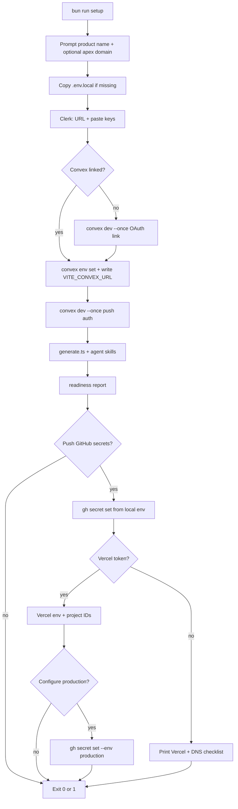

# Setup automation

What `bun run setup` automates, what stays manual, and dashboard URLs for fallbacks.

**Related:** [getting-started.md](./getting-started.md), [environments.md](./environments.md), [ci-cd.md](./ci-cd.md)

## Wizard behavior

- **Idempotent** (safe to re-run anytime): should not duplicate Clerk apps, corrupt [`.reactor/setup.json`](../.reactor/setup.json), or worsen secret placement. Interrupted runs resume; create-or-skip steps skip when already done. Prompts still run (with saved defaults); optional sync steps (GitHub secrets, Vercel) run again only when you confirm them.
- **Interactive** (local TTY): prompts run each time; previous answers from `.reactor/setup.json` are defaults (Enter keeps them).
- **Non-TTY** (CI, piped stdin): skip prompts; use existing `.reactor/setup.json` and env only.
- Dashboard URLs appear as clickable links in setup output. **Follow up** steps are deferred checklists (setup keeps going); **ACTION REQUIRED** only when setup pauses and exits (e.g. Convex link incomplete).

Step-by-step summary: [getting-started.md](./getting-started.md#2-setup-wizard-bun-scriptssetupts).

## Config persistence

### `.reactor/setup.json` (committed, no secrets)

```json
{
  "productName": "My App",
  "productTagLine": "Short marketing tagline",
  "apexDomain": "example.com",
  "github": {
    "org": "acme",
    "repo": "my-app",
    "syncedSecrets": {
      "repo": true,
      "production": true,
      "vercel": true
    }
  },
  "vercel": {
    "synced": true,
    "orgId": "team_…",
    "projectIdWeb": "prj_…",
    "projectIdMarketing": "prj_…",
    "projectNameWeb": "my-app-web",
    "projectNameMarketing": "my-app-marketing"
  },
  "removeMitLicense": true
}
```

- `github.syncedSecrets.repo` — repository secrets for PR CI / E2E (dev Convex + Clerk).
- `github.syncedSecrets.vercel` — repository secrets for Vercel deploy workflows (`VERCEL_TOKEN`, project IDs).
- `github.syncedSecrets.production` — GitHub **production** environment secrets for `release-*` releases.
- `vercel.synced` — Vercel projects, env vars, and domains configured (not a GitHub sync step).

Also writes `packages/config/product.ts` (`PRODUCT_NAME`, `PRODUCT_TAGLINE`), rebrands `README.md` when forking from the template, and when `removeMitLicense` is true replaces MIT [`LICENSE`](../LICENSE) from [`.reactor/LICENSE.proprietary.template`](../.reactor/LICENSE.proprietary.template) (skipped on the upstream `PeterHewat/Reactor` remote).

### Secrets (never in `.reactor/`)

| Location               | Contents                                          |
| ---------------------- | ------------------------------------------------- |
| `apps/web/.env.local`  | `VITE_*`, `CLERK_SECRET_KEY`, E2E vars            |
| Root `.env.local`      | `CONVEX_DEPLOYMENT`, optional `CONVEX_DEPLOY_KEY` |
| GitHub Actions secrets | CI and deploy keys                                |
| Vercel project env     | Build-time `VITE_*` per environment               |

---

## Automated vs manual

### Still manual or checklist-only

| Area                     | Today                                                                                                                              |
| ------------------------ | ---------------------------------------------------------------------------------------------------------------------------------- |
| Account signup / billing | Convex, Clerk, Vercel, GitHub dashboards                                                                                           |
| Convex first link        | Setup runs `convex dev --once` (OAuth in the same terminal); sets Clerk issuer and re-pushes                                       |
| Clerk app creation       | [Clerk CLI](https://clerk.com/docs/cli) (`clerk apps create`, `clerk env pull`) when authenticated; dashboard fallback             |
| Clerk allowed origins    | Automated via Backend API when `CLERK_SECRET_KEY` is set; manual PATCH fallback on failure                                         |
| Apex domain              | Optional in identity wizard (Enter to skip). Re-run setup to add a domain later.                                                   |
| DNS at registrar         | When apex is set: setup prints Vercel nameserver instructions and **pauses** until you confirm (stored as `vercel.dnsConfigured`)  |
| E2E test user            | Wizard defaults `e2e.test@{apex}` when apex is set, else `e2e.test@example.com`; creates user via Clerk API when `sk_test_` is set |
| Org GitHub policies      | Branch protection, required reviewers — outside setup                                                                              |

### Feasibility summary

| Category    | Examples                                                                                                                              |
| ----------- | ------------------------------------------------------------------------------------------------------------------------------------- |
| **Script**  | `PRODUCT_NAME`, `.env.local`, `convex env set`, deploy keys, `gh secret set`, Vercel env via API                                      |
| **Guided**  | Clerk CLI `env pull` or paste keys, inline Convex link, Vercel import, DNS, E2E user                                                  |
| **Manual**  | Account signup, registrar nameserver change (when apex is set), Clerk auth methods, `release-*` release approval, org GitHub policies |
| **Blocked** | Clerk setup without CLI login or dashboard access                                                                                     |

### Optional future (out of scope today)

- Production Clerk keys via `clerk env pull --instance prod` (manual Production step today).

---

## Platform URLs

Placeholders: `{org}`, `{repo}`, `{apex}`, `{vercel-team}`, `{vercel-web-project}`, `{vercel-marketing-project}`.

**Derived hostnames** from apex `example.com`:

| Surface   | Staging (merge to `main`) | Production (Release) |
| --------- | ------------------------- | -------------------- |
| Web       | `preview.example.com`     | `example.com`        |
| Marketing | `preview.www.example.com` | `www.example.com`    |

### Clerk

| Step                          | URL                                                                         |
| ----------------------------- | --------------------------------------------------------------------------- |
| Sign in / home                | [dashboard.clerk.com](https://dashboard.clerk.com)                          |
| Create application            | [dashboard.clerk.com/apps](https://dashboard.clerk.com/apps)                |
| API keys (Development)        | [API keys](https://dashboard.clerk.com/last-active?path=api-keys)           |
| API keys (Production)         | Same path; switch instance to Production                                    |
| JWT templates → Convex preset | [JWT templates](https://dashboard.clerk.com/last-active?path=jwt-templates) |
| Allowed origins (Development) | `PATCH /v1/instance` with `sk_test_…` (setup does this automatically)       |
| Allowed origins (Production)  | Same with `sk_live_…` on the Production step                                |
| Integrations → Convex         | [Integrations](https://dashboard.clerk.com/last-active?path=integrations)   |

After the app exists, setup prompts for `VITE_CLERK_PUBLISHABLE_KEY` and `CLERK_SECRET_KEY`, then derives `CLERK_JWT_ISSUER_DOMAIN` from the Clerk Frontend API URL.

### Convex

| Step                    | URL                                                                                          |
| ----------------------- | -------------------------------------------------------------------------------------------- |
| Dashboard               | [dashboard.convex.dev](https://dashboard.convex.dev)                                         |
| Login (CLI)             | `gh auth login` · `bunx convex login` · `bunx vercel login` · `bunx clerk auth login`        |
| Link / dev deployment   | `bun run dev:convex`                                                                         |
| Dev deployment settings | [Deployment settings](https://dashboard.convex.dev/t/{team}/{project}/{deployment}/settings) |
| Environment variables   | …/settings/environment-variables                                                             |
| Deploy keys             | …/settings/deploy-keys                                                                       |

When linked + Clerk issuer known, setup runs:

```bash
bunx convex env set CLERK_JWT_ISSUER_DOMAIN "https://your-app.clerk.accounts.dev"
bunx convex deployment token create github-ci --save-env
```

### Vercel

| Step                       | URL                                                              |
| -------------------------- | ---------------------------------------------------------------- |
| Dashboard                  | [vercel.com/dashboard](https://vercel.com/dashboard)             |
| Account tokens             | [vercel.com/account/tokens](https://vercel.com/account/tokens)   |
| Import Git repository      | [vercel.com/new](https://vercel.com/new)                         |
| Web project settings       | [Project settings](https://vercel.com/{team}/{project}/settings) |
| Marketing project settings | Same pattern (root dir `apps/marketing`)                         |
| Monorepo link (CLI alpha)  | `vercel link --repo`                                             |

| Project   | Hostname             | Vercel environment            |
| --------- | -------------------- | ----------------------------- |
| Web       | `{apex}`             | Production (Release workflow) |
| Web       | `preview.{apex}`     | Preview — git branch `main`   |
| Marketing | `www.{apex}`         | Production (Release workflow) |
| Marketing | `preview.www.{apex}` | Preview — git branch `main`   |

### GitHub

| Step            | URL                                                                            |
| --------------- | ------------------------------------------------------------------------------ |
| Actions secrets | [Repository secrets](https://github.com/{org}/{repo}/settings/secrets/actions) |
| Environments    | [Environments](https://github.com/{org}/{repo}/settings/environments)          |
| CLI auth        | `gh auth login -s repo,workflow` (setup requests both scopes)                  |

Setup creates the **`production`** environment via `gh api` when your token has `repo` + `workflow`. If creation fails with Forbidden, confirm scopes with `gh auth status` and run `gh auth refresh -h github.com -s repo,workflow`.

Repository secrets (dev stack): [ci-cd.md](./ci-cd.md#repository-secrets). **`production` environment secrets:** same names, prod values.

---

## Setup flow



---

## Security

- Never log secret values; mask in prompts (`pk_test_…`, `sk_test_…`).
- Deploy keys and `CLERK_SECRET_KEY` only in `.env.local`, GitHub Secrets, or Vercel env — never in `.reactor/setup.json` or git.
- `gh secret set` and `vercel env add` read from stdin or env vars, not echo.
- Preview/dev share Clerk test users and Convex dev — never prod credentials in repository secrets ([environments.md](./environments.md)).

---

## CLI reference

```bash
# Identity + readiness wizard (re-run anytime; Enter keeps previous answers)
bun run setup

# Convex (repo-pinned — bunx)
bun run dev:convex
bunx convex env set CLERK_JWT_ISSUER_DOMAIN "https://….clerk.accounts.dev"
bunx convex deployment token create github-ci --save-env

# GitHub (global gh)
gh auth login
gh secret set CONVEX_DEPLOY_KEY < deploy-key.txt
gh secret set VITE_CONVEX_URL --body "https://….convex.cloud"

# Vercel (repo-pinned — bunx)
bunx vercel login
bunx vercel link --repo
bunx vercel env add VITE_CONVEX_URL development

# Clerk (repo-pinned — bunx)
bunx clerk auth login
bunx clerk env pull --file .env.local   # from apps/web
```
